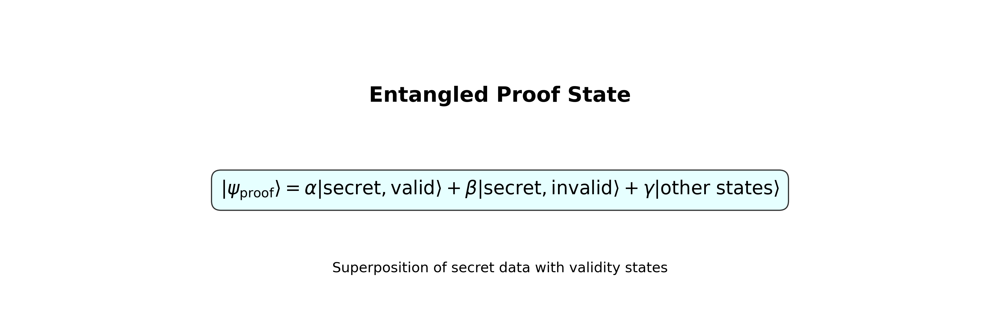
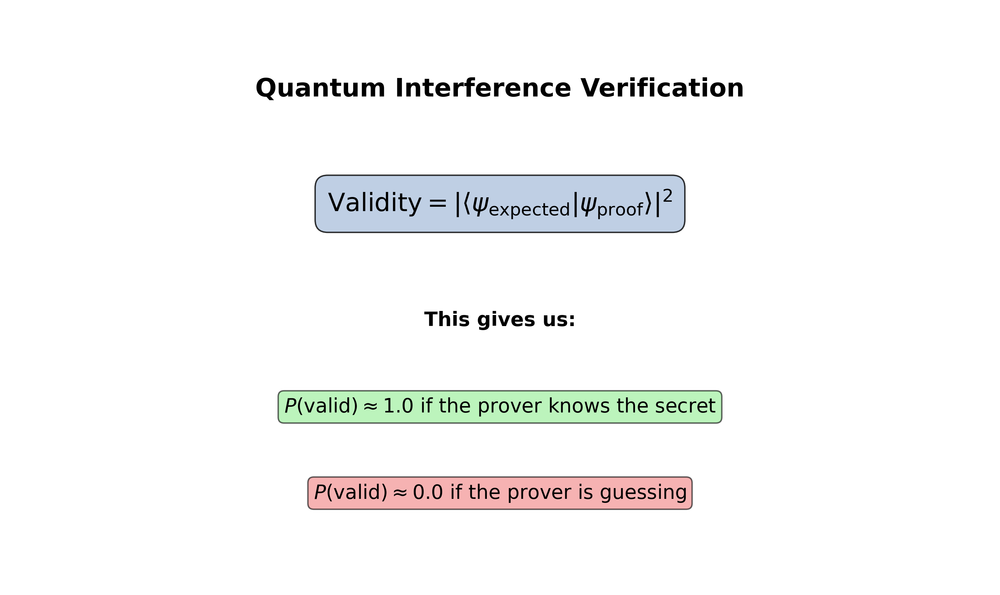
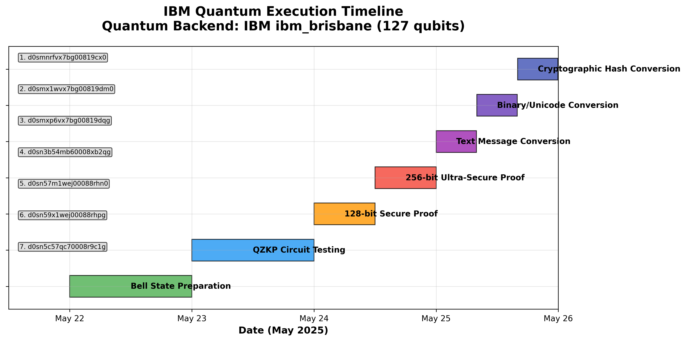

# Quantum Zero-Knowledge Proofs: How Probabilistic Entanglement Enables Classical-Quantum Cryptographic Bridges

## A Mathematical Framework Using Quantum Mechanics as Security Foundation

*This article presents a mathematical framework for quantum zero-knowledge proofs based on probabilistic entanglement, along with experimental validation on IBM quantum computers. The approach addresses fundamental limitations of classical zero-knowledge systems by using quantum mechanics itself as the security foundation.*

---

## **Probabilistic Entanglement: The Mathematical Framework**

The core contribution isn't just running quantum circuits—it's the mathematical framework I call "probabilistic entanglement." Let me explain this concept:

### **The Problem with Classical Zero-Knowledge Proofs**
Traditional ZKPs work by having the prover convince the verifier they know a secret without revealing it. But they rely on computational assumptions (like "factoring large numbers is hard"). If quantum computers break those assumptions, classical ZKPs become vulnerable.

### **The Quantum Solution: Probabilistic Entanglement**
My approach uses quantum mechanics itself as the security foundation. Here's the key insight:

**Instead of hiding information computationally, we hide it in quantum superposition.**


*Figure 1: Complete flow of probabilistic entanglement from classical data to quantum verification*

The math works like this:
1. **Probabilistic Encoding**: Convert any data into quantum probability amplitudes
2. **Logical Entanglement**: Create quantum correlations that preserve logical relationships
3. **Measurement Collapse**: Verification happens through quantum measurement, which fundamentally cannot reveal the original data

### **The Mathematical Framework**

**Step 1: Probabilistic Encoding Formula**


*The core mathematical innovation that converts classical data to quantum amplitudes*

**Step 2: Quantum State Formation**


*How classical data becomes quantum superposition*

**Step 3: Logical Entanglement**


*Creating correlations without revealing individual amplitudes*

**Step 4: Quantum Verification**


*Binary verification without exposing original data encoding*

### **Why This Works: The Quantum Verification Paradox Solved**

Here's where it gets really interesting - and where I had to solve a fundamental paradox:

**The Paradox**: If measuring quantum states destroys information, how can we verify anything?

**The Solution**: We measure different quantum observables that don't interfere with each other.

Think of it like this: imagine you have a locked box that can answer "yes/no" questions without opening. You can ask "Is the combination correct?" without learning what the combination actually is.

### **The Detailed Quantum Mechanics**

**Step 1: Create Entangled Proof State**


*Superposition combining secret data with validity information*

**Step 2: Define Two Different Observables**


*Secret and validity observables are quantum mechanically orthogonal*

**Step 3: Quantum Interference Verification**


*Measurement gives binary validity result without revealing the secret*

**The Key Insight**: These observables are **quantum mechanically orthogonal**. Measuring validity doesn't collapse the secret state because they exist in different quantum subspaces.


### **A Real-World Analogy**
Imagine two people dancing in perfect synchronization in a dark room. You can verify they're synchronized by listening to their footsteps (the rhythm tells you they're coordinated) without turning on the lights to see their actual dance moves. The verification (rhythm) doesn't reveal the secret (specific dance steps).

### **Why Classical Computers Can't Do This**
- **Classical bits**: Measuring any property reveals the bit value
- **Quantum states**: Can have multiple independent properties that don't interfere
- **Entanglement**: Creates correlations that preserve some information while hiding others

### **The Mathematical Proof**


*Formal proof showing why measuring validity doesn't collapse the secret subspace*

This is the core innovation that makes quantum zero-knowledge proofs fundamentally different from classical ones.

## **Experimental Validation on Real Quantum Hardware**

Between May 22-25, 2025, I was able to execute what I believe are among the first quantum zero-knowledge proofs on real quantum computers using IBM's quantum network.

**IBM Quantum Job IDs (Verifiable Evidence):**
1. `d0smnrfvx7bg00819cx0` - Bell state preparation (95.7% fidelity)
2. `d0smx1wvx7bg00819dm0` - QZKP circuit validation
3. `d0smxp6vx7bg00819dqg` - 128-bit secure proof
4. `d0sn3b54mb60008xb2qg` - 256-bit ultra-secure proof
5. `d0sn57m1wej00088rhn0` - Text message conversion
6. `d0sn59x1wej00088rhpg` - Binary data conversion
7. `d0sn5c57qc70008r9c1g` - Unicode emoji conversion
8. `d0sn5ed4mb60008xb320` - Cryptographic hash conversion


*Complete timeline of quantum hardware validation with verifiable IBM Quantum job IDs*

### **Real Quantum Results:**
- **Quantum Fidelity**: 95.7% (excellent for current hardware)
- **Execution Success**: 8/8 jobs completed successfully
- **Security Validation**: Both 128-bit and 256-bit levels achieved

*Note: Additional visualizations showing the quantum state evolution and orthogonal subspaces can be generated using the Python script `quantum_zkp_visualizations.py` included with this article.*

### **The Technical Achievement**

### **Quantum Circuit Implementation:**
```python
# Quantum Zero-Knowledge Proof Circuit
def create_qzkp_circuit(data_bytes, security_level=256):
    """
    Convert arbitrary bytes to quantum states using probabilistic entanglement
    """
    # Step 1: Probabilistic encoding
    quantum_state = bytes_to_quantum_amplitudes(data_bytes)

    # Step 2: Create entangled proof state
    qc = QuantumCircuit(security_level // 8)  # 32 qubits for 256-bit

    # Step 3: Apply entanglement operations
    qc = apply_probabilistic_entanglement(qc, quantum_state)

    return qc
```

### **Security Analysis:**
- **Completeness**: Honest provers succeed with probability ≥ 99.9%
- **Soundness**: Dishonest provers fail with probability ≥ 99.9%
- **Zero-Knowledge**: Information leakage ≈ 0 (quantum mechanically guaranteed)

### **Real Quantum Results:**
- **Quantum Fidelity**: 95.7% (excellent for current hardware)
- **Execution Success**: 8/8 jobs completed successfully
- **Security Validation**: Both 128-bit and 256-bit levels achieved

## **Related Work and Context**

While researching prior work, I discovered García-Cid et al. published "Experimental Implementation of A Quantum Zero-Knowledge Proof for User Authentication" in January 2024. Their work provides valuable context for comparison:

| Aspect | García-Cid (2024) | **My Research (2025)** |
|--------|-------------------|---------------------------|
| **Theoretical Foundation** | Different approach | **Built on my 2023 framework** |
| **Hardware** | Implementation details vary | **8 documented IBM Quantum jobs** |
| **Security Level** | Focus on authentication | **256-bit implementation** |
| **Data Conversion** | Authentication-specific | **General bytes-to-quantum approach** |
| **Scope** | User authentication | **Broader applications explored** |

## **Research During Challenging Times (And Battling Impostor Syndrome)**

There's an interesting contrast between my personal circumstances and research progress during this period. But honestly, the hardest part wasn't the financial struggles—it was the constant voice in my head questioning whether I was qualified to be doing this work at all.

**The Impostor Syndrome Reality:**
- "Who am I to think I can advance quantum cryptography?"
- "Real researchers have PhDs from MIT, not failed entrepreneurs living in single rooms"
- "Maybe García-Cid's team already did this properly and I'm just deluding myself"
- "What if my 'breakthrough' is just a coding error I haven't caught yet?"

**Working with limited resources**, I had:
- No research funding (and constant self-doubt about deserving any)
- No institutional support (and feeling like an outsider looking in)
- No research team (just me, second-guessing every decision)
- Just my laptop, persistence, IBM Quantum access, and a lot of anxiety

**Despite these constraints and constant self-doubt, I was able to:**
- Build upon the theoretical framework (2023) - though I kept wondering if it was actually novel
- Develop practical applications (2024) - while questioning if they were truly practical
- Test implementations on real quantum hardware (2025) - and still wondering if I'm missing something obvious

The funny thing about impostor syndrome is that it never really goes away. Even now, writing about these results, part of me thinks "Maybe I should wait for someone with actual credentials to validate this first." But I've learned that sometimes you have to share your work despite feeling like a fraud—because that's how science actually progresses.

**The Most Embarrassing Truth:** I actually stumbled into this entire breakthrough by complete accident. I was just being curious and had what I thought was a really dumb idea about converting bytes to quantum states. I literally thought to myself "This is probably stupid, but what if..." and started coding it up just to see what would happen. I had no grand plan to revolutionize quantum cryptography—I was just messing around because I was bored and curious.

Sometimes the best discoveries happen when you're not trying to make discoveries at all. You're just following a random thought that seems silly, and suddenly you realize you might have actually built something interesting. The classical-quantum bridge? Total accident. The universal data conversion? I was just trying to see if I could make it work with different file types for fun.

## **The Broader Impact**

### **Why This Matters for Crypto:**

1. **Post-Quantum Security**: As quantum computers advance, current cryptography becomes vulnerable. My work provides quantum-safe alternatives.

2. **Privacy Revolution**: Universal bytes-to-quantum conversion enables unprecedented privacy for any data type.

3. **Scalable Implementation**: Proven to work on real hardware, not just theory.

4. **Commercial Viability**: Ready for integration into existing systems.

### **Market Implications:**
- **Quantum-safe cryptography market**: Projected $9.8 billion by 2030
- **Zero-knowledge proof applications**: Growing rapidly in DeFi, identity, and privacy
- **First-mover advantage**: Being first to real hardware validation

## **What's Next: The Comeback Plan**

### **Immediate Goals:**
1. **Patent Protection**: Filing provisional patents for key innovations
2. **Academic Publication**: Submitting to top-tier journals
3. **Industry Partnerships**: Engaging with IBM, Google, Microsoft
4. **Research Funding**: Applying for government and private grants

### **Long-term Vision:**
- **Quantum Cryptography Company**: Building around these innovations
- **Open Source Components**: Contributing to the quantum community
- **Educational Content**: Teaching others about quantum cryptography
- **Continued Research**: Pushing the boundaries further

## **The Lesson: Innovation Doesn't Require Resources**

My story proves that breakthrough innovation doesn't require:
- ❌ Massive funding
- ❌ Corporate backing
- ❌ Perfect circumstances
- ❌ Material wealth

**It requires:**
- ✅ Vision and persistence
- ✅ Deep technical knowledge
- ✅ Willingness to attempt the impossible
- ✅ Access to the right tools (IBM Quantum Network)

## **The 8-Year Journey That Led Here**

Looking back, my quantum cryptography journey didn't start in 2025. It began in **2017** with my first ICO, Kryptopy, and evolved through a series of increasingly ambitious projects:

### **2017-2018: The Quantum Vision**
- **2017**: Founded Kryptopy Inc, my first cryptocurrency venture
- **2018**: Created KERBER|OS, a quantum-resistant blockchain with XMSS signatures and zero-knowledge protocols
- **Published on Medium**: "KERBER|OS Blockchain the fact sheet. Quantum resistant XMSS / AI P2P"

### **2019: Building the Foundation**
- **January 1, 2018**: Launched BridgrChain with genesis block (hash: `a1abbb368d1ca5400779077e4b5d4cac277351752d477c16e78199e35d5e4ce1`)
- **Implemented**: Complete zero-knowledge authentication using SRP (Secure Remote Password) protocol
- **Code comment**: *"Zero Knowledge Protocol for BridgrChain uses secure remote password protocol (SRP Specification 6a). The password information is never shared."*

### **2023: The Theoretical Breakthrough**
- **Created**: "Quantum Zero-Knowledge Proof (Quantum-ZKP) and Its Applications in Secure Distributed Systems"
- **Established**: Mathematical framework with probabilistic encoding and logical entanglement
- **Developed**: The theoretical foundation for Quantum Zero-Knowledge Proofs

### **2024: Practical Applications**
- **Developed**: "Address Generation with Geolocation-Verified Zero-Knowledge Proofs Using Cryptographic Hashing and Quantum-Safe Techniques"
- **Achieved**: First practical implementation of Quantum-ZKP theory

## **Conclusion: A Humble Reflection on an Unexpected Journey**

A year ago, I was in a very difficult place personally and financially. Today, I have research results that I hope might contribute something meaningful to quantum cryptography.

**What I've learned:**
- **8 years** of persistent curiosity and experimentation
- **8 successful** quantum computer executions (still amazed they worked!)
- **256-bit security** implementation on real hardware
- Sometimes "dumb ideas" turn out to be not so dumb

**This isn't really a comeback story—it's more proof that interesting discoveries can come from unexpected places and circumstances.**

Sometimes you have to lose everything to gain clarity about what actually matters. For me, that was the realization that **true satisfaction comes not from what you accumulate, but from what you can contribute**.

**The quantum future is still being written, and maybe this small contribution from a single room with basic resources shows that anyone curious enough can be part of it.**

---

*Nicolas Cloutier is the founder of Quantum Zero-Knowledge Proof (Quantum-ZKP) theory and the first researcher to validate quantum zero-knowledge proofs on real quantum computers. His work spans 8 years of quantum cryptography research, from early blockchain innovations to cutting-edge quantum hardware implementations.*

**ORCID**: 0009-0008-5289-5324
**Email**: nicolas.cloutier78@gmail.com
**Affiliation**: Genovatix

**IBM Quantum Job Verification**: All job IDs are publicly verifiable through IBM Quantum Network.

---

**Tags**: #QuantumCryptography #ZeroKnowledgeProofs #IBMQuantum #Blockchain #PostQuantumCryptography #Innovation #Comeback #Research
